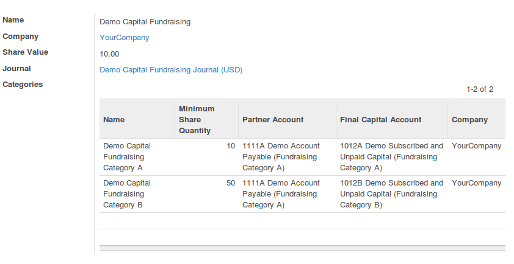
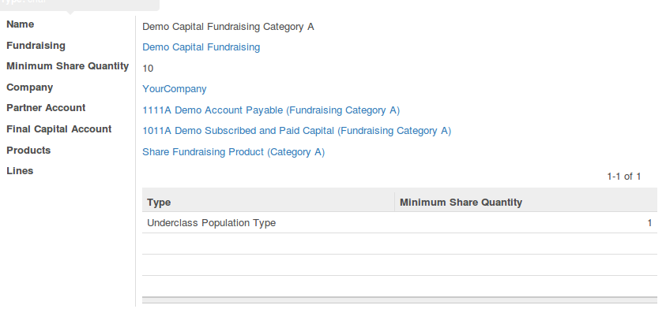
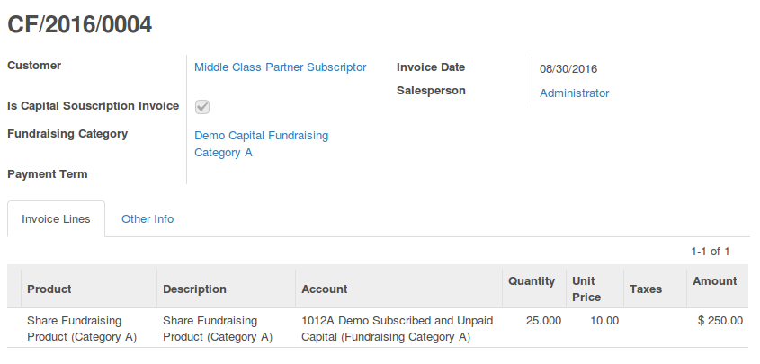
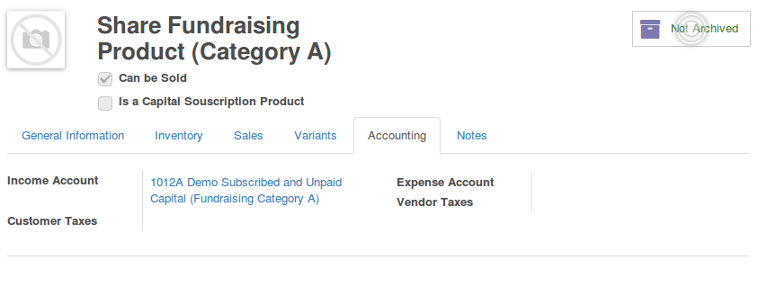

This module has been developped to manage capital fundraising for companies.
(classical companies, cooperatives, ...)

A fundraising is defined by
- a share value. (10 € in the sample below)
- category or categories of fundraising. (many categories is optional)

A category is defined by
- a minimum quantity of shares to buy
- this quantity can be reduced for a given type of partners.
- a partner account that will be used instead of the default customer receivable account (optional settings)
- an account for the subscribed and paid capital that will be used to when the payment is reconciled (optional settings)

A capital subscription is done with a classical customer invoices, with some extra options.

The account of unpaid capital should be set on product form.

