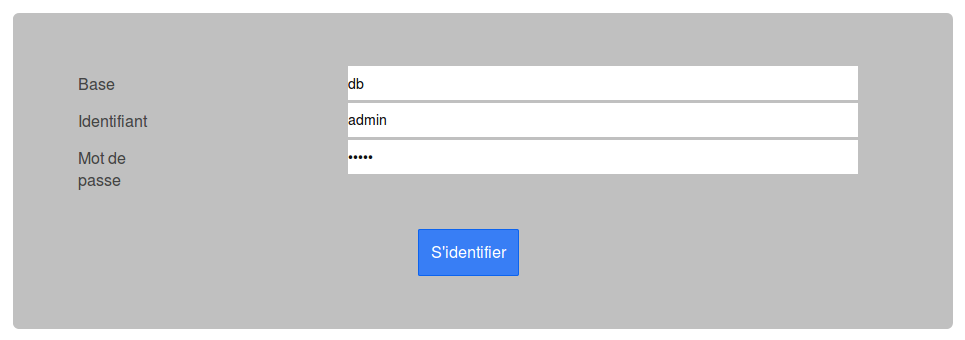
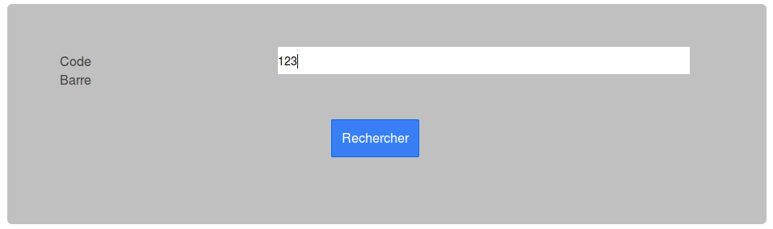
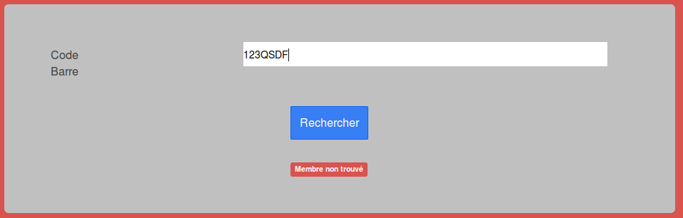
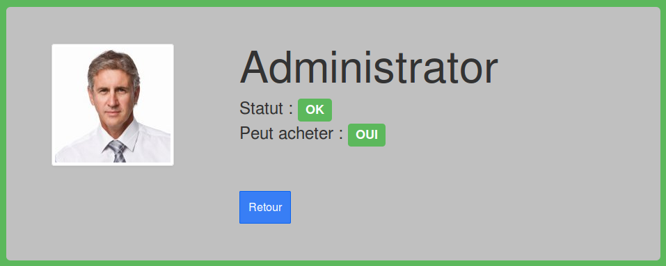
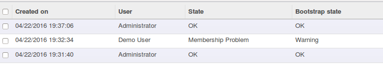

Once installed, the apps is available via this url
http://localhost:8069/coop_badge_reader/static/www/index.html (by default)

You can prefill identification data on the form, using parameters
http://localhost:8069/coop_badge_reader/static/www/index.html#/login?db=DATABASE&username=USERNAME&password=PASSWORD

If all parameters are provided, auto submit is done, to try identification.

Note : set password in an url can generate security breaches.

Authentication
--------------

User must select Database name, login and password. (The user must be
member of the new group 'Coop Badge Reader / Time Clock')

User Search
-----------

User should scan User barcode.

If the barcode is unknown a specific sound is played.

Partner Form
------------

If the barcode matches with a user, the partner is display with some
informations.

If the partner has some special state, an alternative background color is
displayed with the reason.

Move Logs
---------

The use of this badge reader is logged and and logs are available in
back-office

Technical Information - Back office
-----------------------------------

* Create a new group 'Coop Badge Reader / User' User must be member
  of that group to access to the history of the logs;

* Create a new group 'Coop Badge Reader / Time Clock' User must be member
  of that group to log into the JS apps;

* Create a new group 'Coop Badge Reader / Manager' User must be member
  of that group to manage (update or delete) logs in backoffice;

Technical Information - JS Apps
-------------------------------

The extra libs used are

* Bootstrap - v3.3.6 <http://getbootstrap.com>

* AngularJS - v1.3.15 <http://angularjs.org>

* IonicJS - v1.0.0 <http://ionicframework.com/>

* Angular Odoo <https://github.com/akretion/angular-odoo>, little JS framework
  based on angular, that provides functions to connect and communicate with
  Odoo / OCB